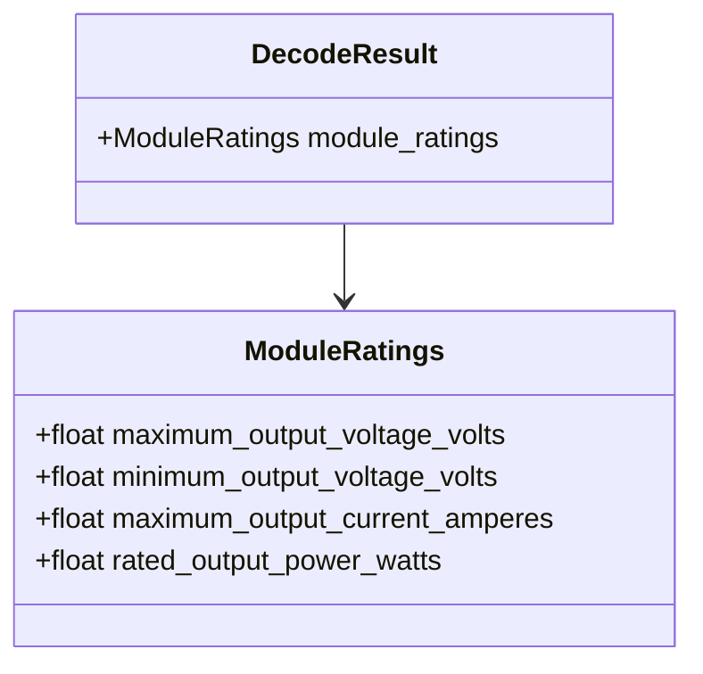

# Class diagram — module ratings

## Context

This class view defines the typed output for command `0x0A` without coupling it to hardware or
the UI.

## Diagram

## Notes

- The field names carry units to keep exports and UI display unambiguous.
- Raw integer encoding is an implementation detail of the protocol adapter.
