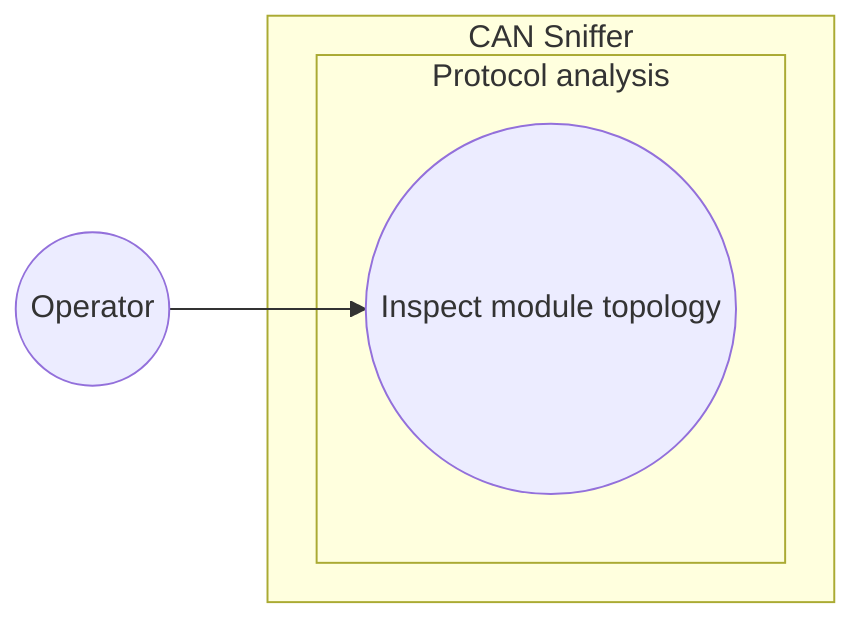

# Use-case diagram — module topology decoding

> **Feature**: Issue [#37](https://github.com/benoit-bremaud/can-sniffer/issues/37) — decode Infypower module topology information
> **Source specification**: [`module-topology.md`](../../specs/module-topology.md)

## Context

This diagram scopes the operator goal of inspecting topology information already present in a
received or replayed Infypower frame. It excludes active discovery, query transmission, and UI
navigation.

## Diagram

## Notes

- The observable outcome is a module count or an individual module group number.
- Live capture and offline replay are two sources for the same operator goal, not separate use
  cases.
- No component, class, state, or data-flow diagram is warranted: the feature adds no boundary,
  lifecycle, sensitive data flow, or complex type relationship.
