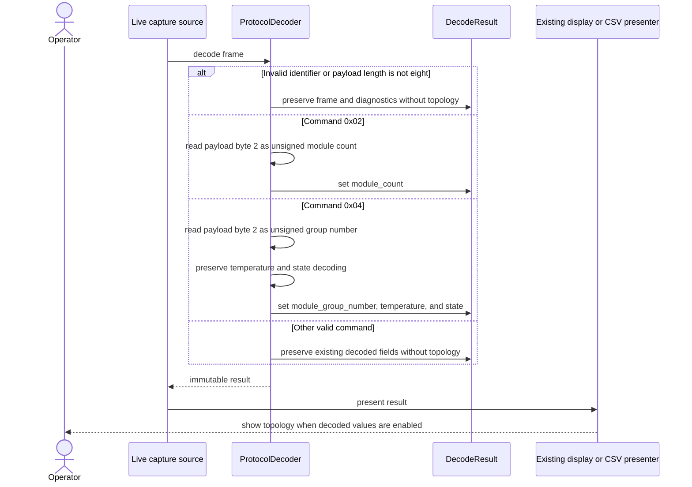

# Sequence diagram — module topology decoding

> **Feature**: Issue [#37](https://github.com/benoit-bremaud/can-sniffer/issues/37) — decode Infypower module topology information
> **Source specification**: [`module-topology.md`](../../specs/module-topology.md)

## Context

This sequence shows how the existing pure decoder and presenters collaborate for eligible and
ineligible frames. It specifies no new layer or infrastructure dependency.

## Diagram

## Notes

- `ProtocolDecoder` remains framework- and I/O-independent.
- The existing source and presenter boundaries remain unchanged and depend on the domain result.
- Offline replay decoding is outside this feature and tracked by Issue
  [#40](https://github.com/benoit-bremaud/can-sniffer/issues/40).
- Zero is represented as a decoded integer, while absence is represented by `None`.
- No Strategy, Factory, Repository, or additional service is justified for two fixed command
  branches.
