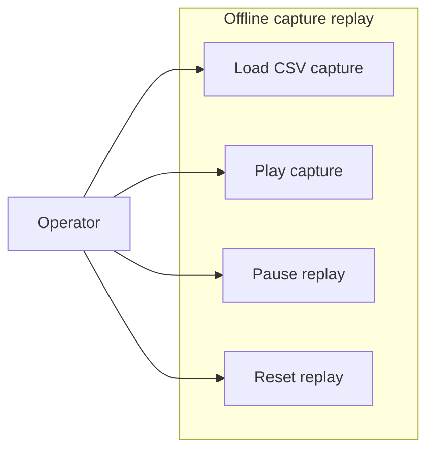

# Use-case diagram — offline replay

> **Feature**: issue #19 — [replay exported CAN captures offline](../../specs/offline-replay.md)

## Context

This diagram identifies the operator goals for loading and replaying a saved capture locally.
The replay boundary explicitly excludes CAN transmission.

## Diagram

## Notes

- Replay is a local file operation.
- No use case opens SocketCAN or sends a frame.
