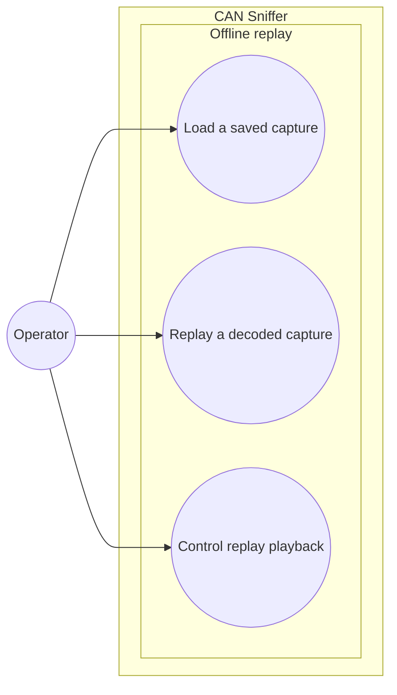

# Use-case diagram — offline replay

> **Feature**: issues #19 and #40 — [replay exported CAN captures offline with semantic decoding](../../specs/offline-replay.md)

## Context

This diagram identifies the operator goals for loading and replaying a saved capture locally.
Semantic values are restored from each raw frame before playback. The system boundary explicitly
excludes CAN transmission.

## Diagram

## Notes

- Replay is a local file operation.
- Loading restores semantic values from raw frames without parsing presentation text.
- Pause, stop, and reset are playback controls under one operator goal, not separate use cases.
- No use case opens SocketCAN or sends a frame.
