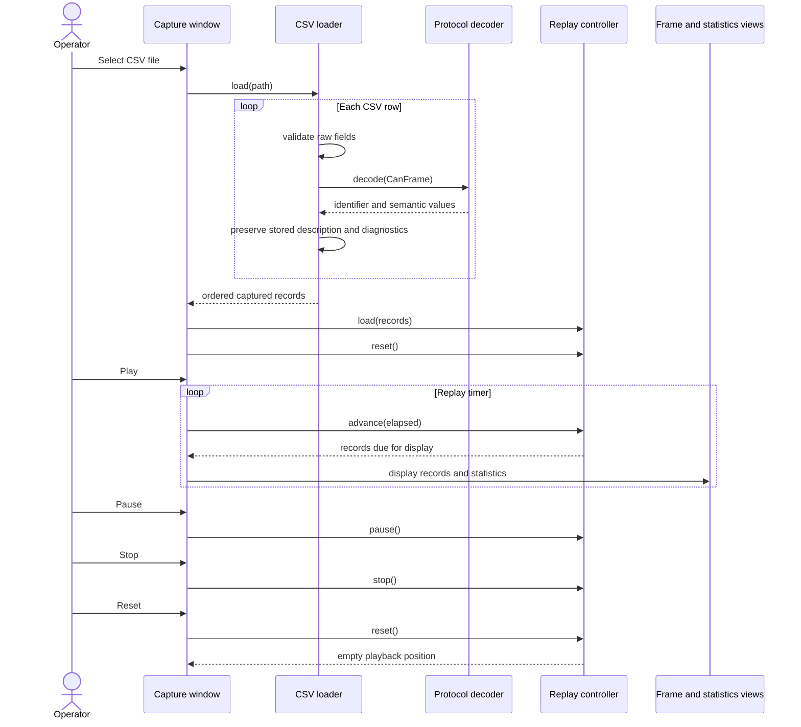

# Sequence diagram — replay a CSV capture

> **Feature**: issues #19 and #40 — [replay exported CAN captures offline with semantic decoding](../../specs/offline-replay.md)

## Context

This sequence clarifies the boundary between file loading, one-time semantic decoding, local
replay timing, and the existing display/statistics workflow.

## Diagram

## Notes

- The loader never parses the human-readable `decoded_values` column.
- Protocol decoding runs once per row before playback starts.
- The replay controller has no CAN port dependency.
- Pause stops local playback timing only.
