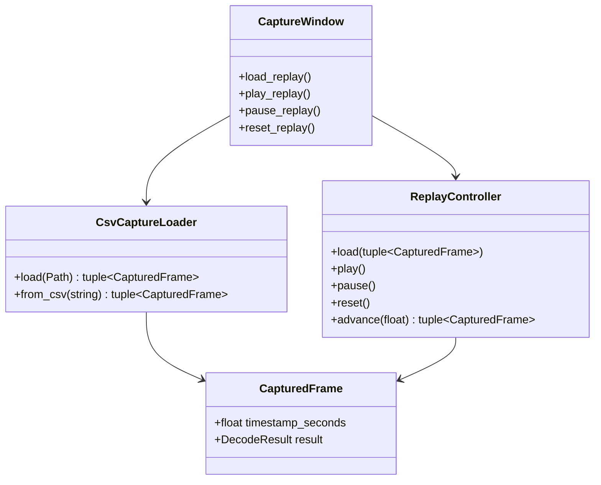

# Class diagram — offline replay

> **Feature**: issue #19 — [replay exported CAN captures offline](../../specs/offline-replay.md)

## Context

This class view defines the pure loader and replay contracts. Qt file dialogs and timers remain
at the application boundary.

## Diagram

## Notes

- The loader validates data and does not access SocketCAN.
- Replay timing is deterministic and testable without Qt.
