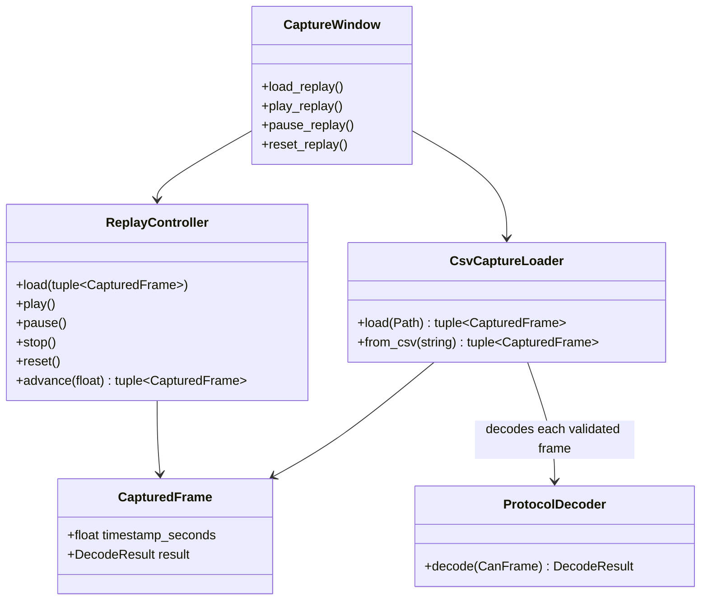

# Class diagram — offline replay

> **Feature**: issues #19 and #40 — [replay exported CAN captures offline with semantic decoding](../../specs/offline-replay.md)

## Context

This class view defines the pure loader, decoder, and replay collaborations. Qt file dialogs and
timers remain at the application boundary.

## Diagram

## Notes

- The loader validates data, calls the pure decoder once per row, combines current and unique
  stored diagnostics, and does not access SocketCAN.
- No decoder interface is introduced because there is one deterministic implementation and no
  infrastructure boundary to substitute.
- Replay timing is deterministic and testable without Qt.
