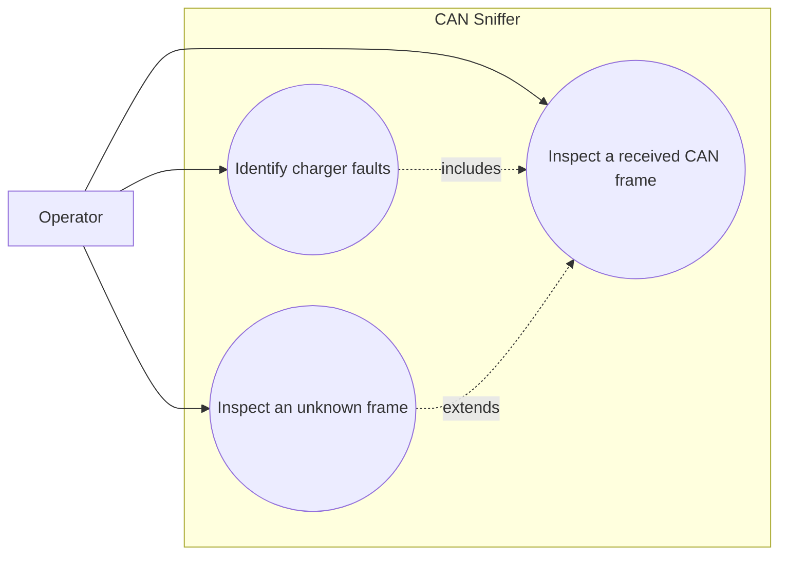

# Use-case diagram — protocol decoder

## Context

This diagram defines the operator goal for inspecting charger frames. It does not describe
internal modules or the graphical navigation.

## Diagram

## Notes

- The decoder must preserve the raw frame when a protocol field is unknown or invalid.
- Fault identification is an observable result of inspecting a frame, not a background actor.
