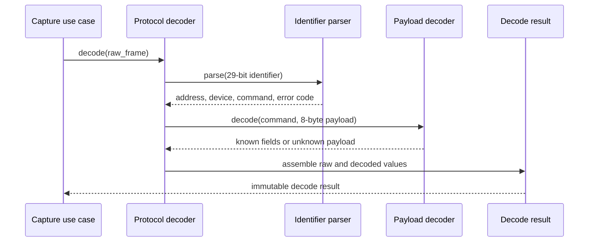

# Sequence diagram — protocol decoder — decode one frame

## Context

This sequence defines the synchronous, side-effect-free decoding path for one received frame.
Capture and UI adapters are outside the decoder boundary.

## Diagram

## Notes

- Invalid identifiers and payloads produce diagnostics without throwing away the raw frame.
- No UI, filesystem, clock, or hardware dependency is allowed in this sequence.
