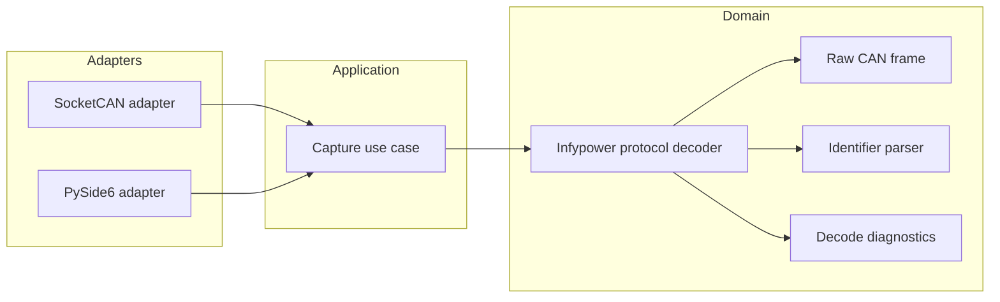

# Component diagram — protocol decoder

## Context

This diagram fixes the dependency direction between the domain decoder and the infrastructure
that will later provide frames. It does not prescribe a package for every future feature.

## Diagram

## Notes

- Dependencies point toward the domain.
- The protocol decoder must not import `python-can` or PySide6.
- The first implementation should use value objects and pure functions where practical.
