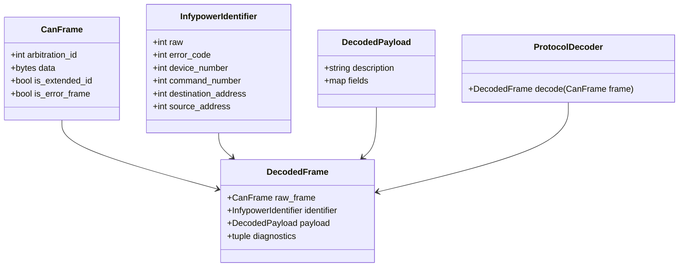

# Class diagram — protocol decoder

## Context

This class view identifies the minimum domain types required to decode the documented 29-bit
Infypower identifier and preserve unknown frames. Concrete adapters are intentionally absent.

## Diagram

## Notes

- `CanFrame` is a domain representation, not `can.Message`.
- Mutable dictionaries should not become the long-term public domain API; typed payloads should
  be introduced when command-specific decoding is implemented.
- Error code and address bit masks must be tested against the protocol examples.
