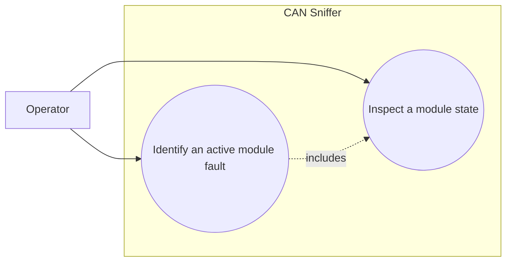

# Use-case diagram — module state decoding

## Context

This diagram scopes the operator goal of identifying charger module health from a received
command `0x04` response. It does not model UI navigation or hardware access.

## Diagram

## Notes

- Every documented state bit must be represented by a stable, named result.
- A frame with no active bits is valid and must not be treated as an error.
