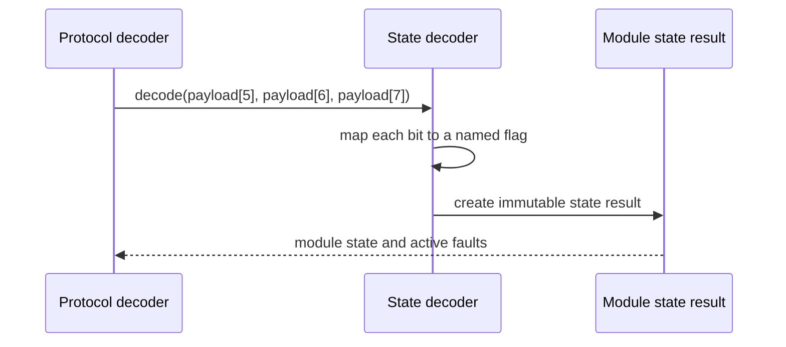

# Sequence diagram — module state decoding — command 0x04

## Context

This sequence defines how the pure protocol decoder turns bytes 5 to 7 of a valid `0x04`
response into named state flags and diagnostics.

## Diagram

## Notes

- The ambient temperature at payload byte 4 is decoded separately from the state bytes.
- Unknown commands remain raw and do not enter this sequence.
