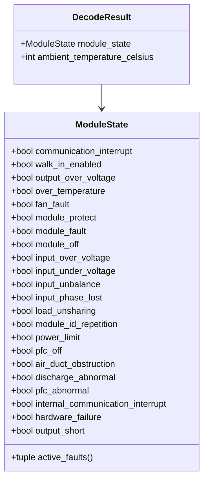

# Class diagram — module state decoding

## Context

This class view defines the typed output for the three state bytes documented by Infypower.

## Diagram

## Notes

- A named boolean is preferred to exposing bit masks to the UI.
- `active_faults()` is derived from the flags and has no I/O side effects.
