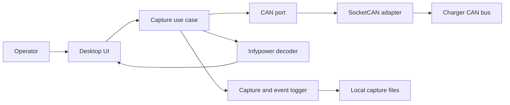

# System context

```mermaid
flowchart LR
    User[Operator] --> UI[Desktop UI]
    UI --> Capture[Capture use case]
    Capture --> CanPort[CAN port]
    CanPort --> Adapter[SocketCAN adapter]
    Adapter --> Bus[Charger CAN bus]
    Capture --> Decoder[Infypower decoder]
    Decoder --> UI
    Capture --> Logger[Capture and event logger]
    Logger --> Files[Local capture files]
```

The domain decoder must not depend on the UI, Python-CAN, SocketCAN, or file formats.
