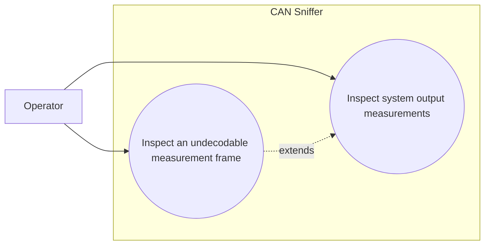

# Use-case diagram — system measurements

## Context

This diagram scopes the operator goal of inspecting the charger system output measurements
from a valid Infypower command `0x01` response.

## Diagram

## Notes

- The raw eight-byte payload remains available beside decoded values.
- A `0x01` frame with invalid payload length is diagnostic, not silently accepted.
