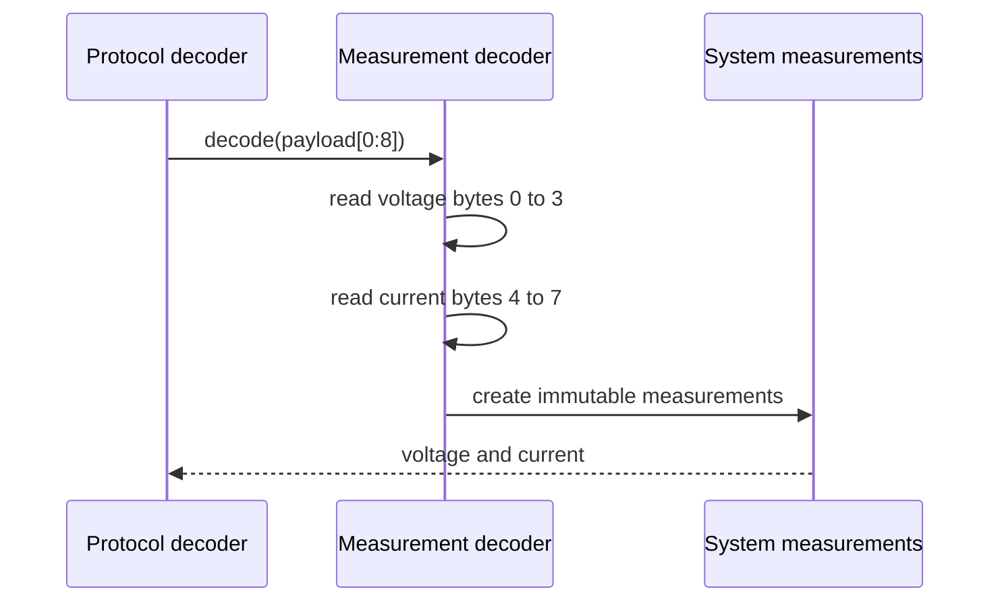

# Sequence diagram — system measurements — command 0x01

## Context

This sequence defines the pure decoding of the two IEEE-754 single-precision values in a
command `0x01` response.

## Diagram

## Notes

- Values are decoded as big-endian IEEE-754 binary32 according to the protocol examples.
- No unit conversion is required for command `0x01`; values are already expressed in volts
  and amperes.
