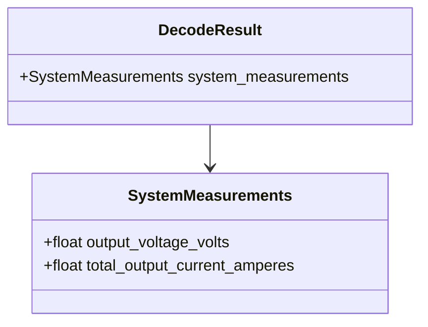

# Class diagram — system measurements

## Context

This class view defines the typed output for command `0x01` while keeping raw frame data in the
common decode result.

## Diagram

## Notes

- Field names include units to prevent UI and export ambiguity.
- The decoder must preserve signed zero, infinity, and NaN bit patterns as decoded floats;
  policy for displaying non-finite values belongs to the application layer.
