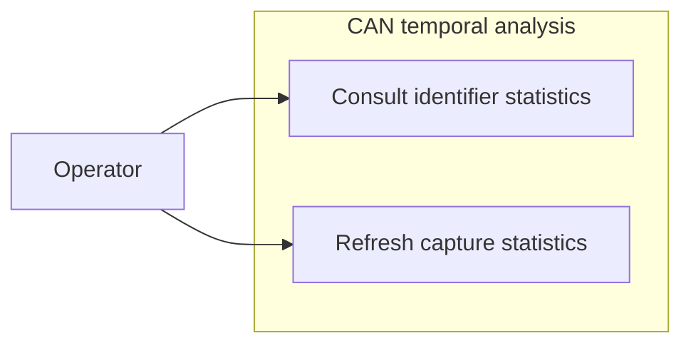

# Use-case diagram — temporal analysis

> **Feature**: issue #17 — [temporal analysis of captured CAN frames](../../specs/temporal-analysis.md)

## Context

This diagram identifies the operator goal of understanding message cadence from a read-only
capture. It does not cover CAN transmission or protocol timing validation.

## Diagram

## Notes

- Statistics are derived from retained records.
- The analysis is independent of the visible frame filter.
