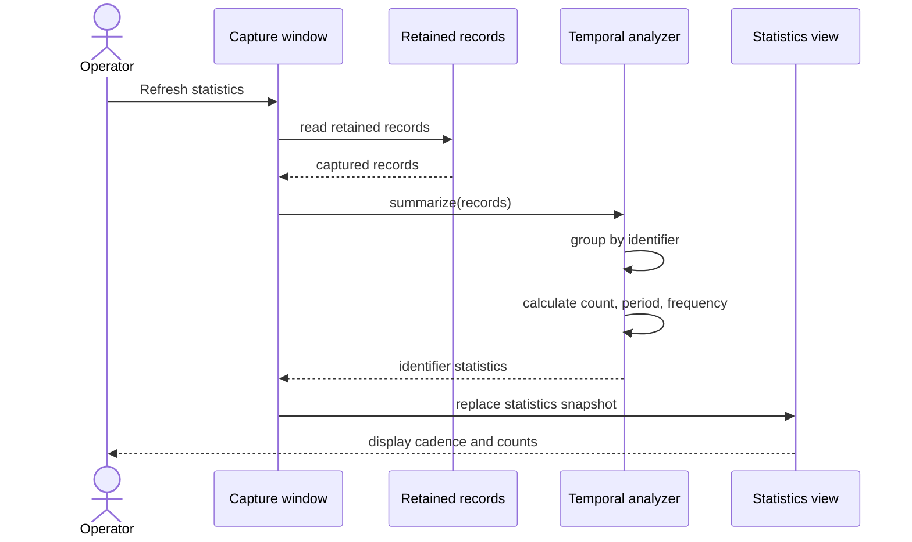

# Sequence diagram — refresh temporal statistics

> **Feature**: issue #17 — [temporal analysis of captured CAN frames](../../specs/temporal-analysis.md)

## Context

This sequence clarifies how the UI requests a snapshot of temporal statistics while capture
continues independently.

## Diagram

## Notes

- The analyzer is pure and does not access Qt, SocketCAN, or the filesystem.
- A capture can remain active while a statistics snapshot is refreshed.
