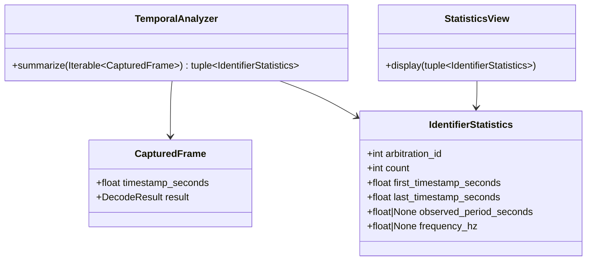

# Class diagram — temporal analysis

> **Feature**: issue #17 — [temporal analysis of captured CAN frames](../../specs/temporal-analysis.md)

## Context

This class view defines the smallest pure model for grouping retained records and calculating
safe temporal statistics.

## Diagram

## Notes

- `TemporalAnalyzer` owns calculation rules and remains framework-independent.
- `None` represents insufficient or invalid timing data.
- The statistics view is a UI concern and is not part of the pure analysis module.
